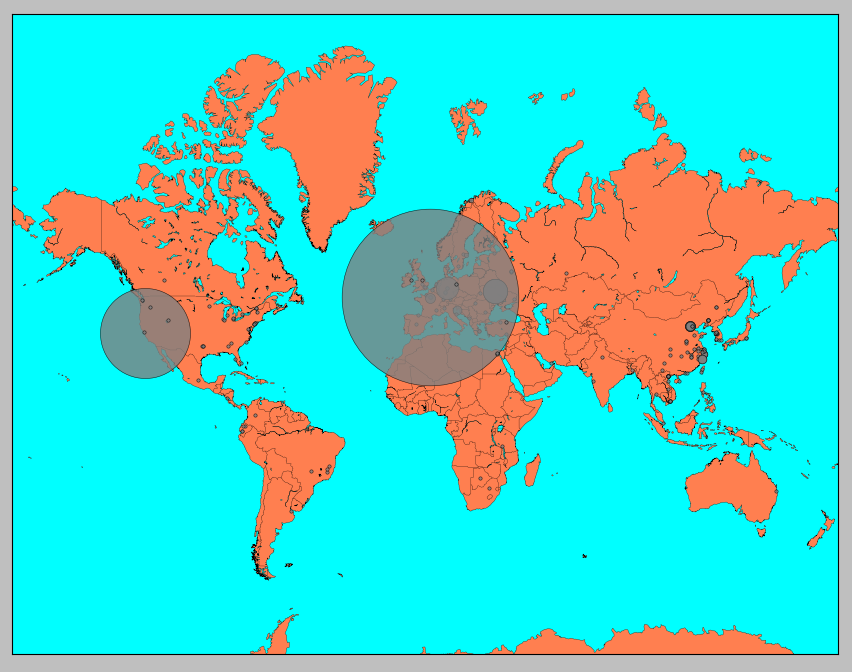

# Auth log geo lookup
Did you ever wonder where (geographically) the unwanted bot-traffic on your public server comes from? This is the right tool for you!



It's possible to scan the auth log for IP addresses and locate them on a map. As lookup service, [ipinfo.io](https://ipinfo.io/) is used. It's free for 1000 requests per day (if you need more, head over to their website to sign-up).

## Usage
Simply call the python script with the path to your auth log file. For analysing the log on the current machine:
```
$ python lookup.py /var/log/auth.log
```

If you like to check a different machine, you first have to get the log locally and then run:
```
$ python lookup.py auth.log
```


## Dependencies
- requests
- matplotlib
- mpl_toolkits.basemap

You can install these packages via pip.

## Things to mention
The location pinned on map might not be the real position of the bot since they might use proxies.

## ToDo's
- Group marker
- Find a faster, more free lookup service
- Check argv
